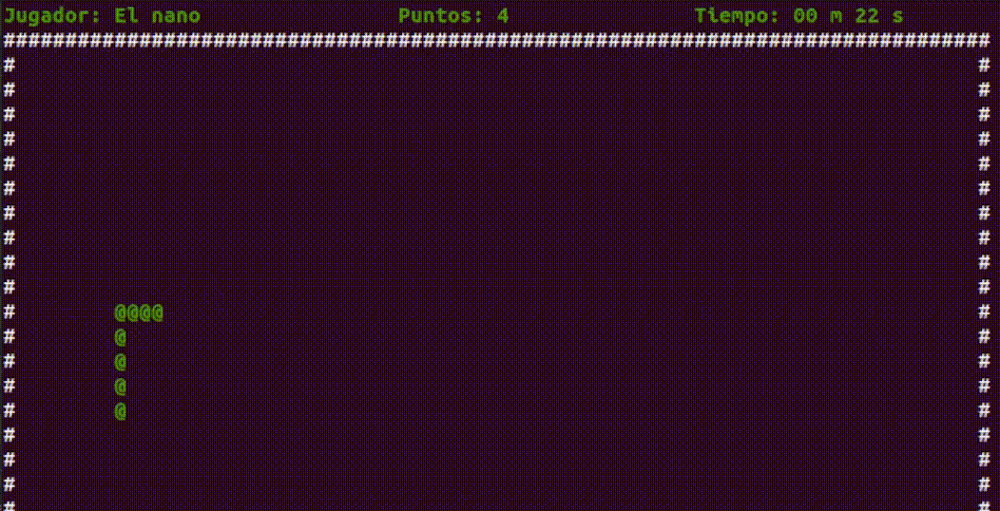
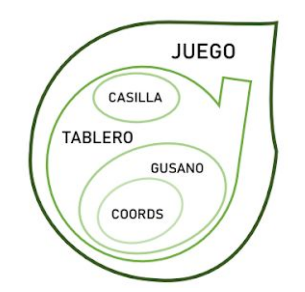

# Gusanito :bugs:
Projecte final de l'assignatura Fonaments d'Ordinadors avaluat amb un 10. Es tracta del mític joc del _gusanito_ implementat en **C**.


<p align="center">
  <br />
</p>


## Juga!
### Instal·lació
Per començar, clona el repositori utilitzant la següent comanda: 

```bash
$ git clone https://github.com/victhormoreno/Gusanito
```

### Compilar
Un cop clonat el repositori, entra dins la carpeta i comprova que està inclòs l'executable `play`:

```bash
$ cd ~/path/gusano
$ ls
docs  include  play
  README.md  src
```

Si l'executable play no es troba a la carpeta, hauràs de compilar el codi font abans de continuar de la següent forma:

```
$ gcc -o play  src/main.c src/Modules/juego.c src/Modules/tablero.c src/Modules/gusano.c src/Modules/casilla.c src/Modules/coords.c src/Utils/azar.c src/Utils/colores.c src/Utils/tamanyo_terminal.c src/Utils/teclas_tictac.c -Iinclude
```

### Executar
Finalment, pots començar a jugar:

```bash
$ ./play
```

### Arquitectura
Per a més informació del que fa cada funció accedir [aquí](/docs/Full%20ACTA%20%2B%20Calendari%20%2B%20Mapa%20llibreries%20i%20funcions.pdf).

<p align="center">
  <br />
</p>
